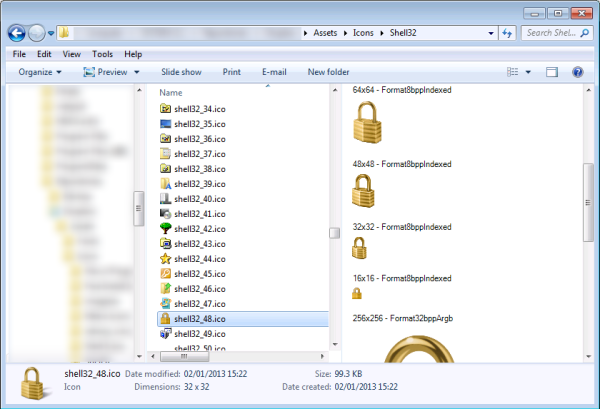
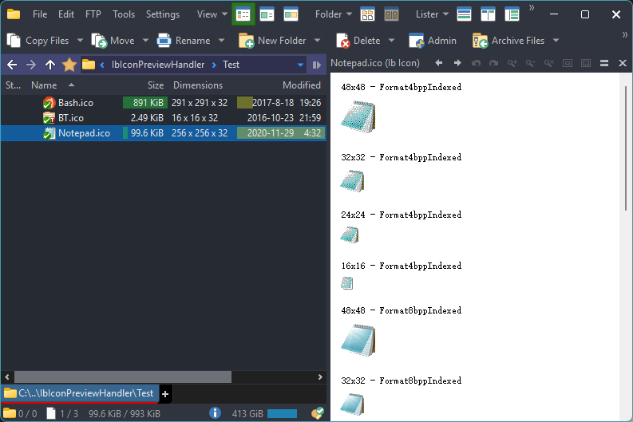

# IbIconPreviewHandler
An icon preview handler for Windows Shell.  
Based on source code of [SharpShell](https://github.com/dwmkerr/sharpshell)'s IconPreviewHandler.

It can show the user all of the images contained in an icon file when one is selected, just as below:

It can also be used in some third-party file managers, like in [Directory Opus](https://www.gpsoft.com.au/) ([中文介绍](https://github.com/Chaoses-Ib/DirectoryOpus)):

## Installation
1. Download the zip from [Releases](https://github.com/Chaoses-Ib/IbIconPreviewHandler/releases)
2. Unzip it to a fixed location
3. Run `install.bat`

## Credits
This project uses the following libraries:
* [SharpShell](https://github.com/dwmkerr/sharpshell)
* [IconLib](https://www.codeproject.com/Articles/16178/IconLib-Icons-Unfolded-MultiIcon-and-Windows-Vista)
